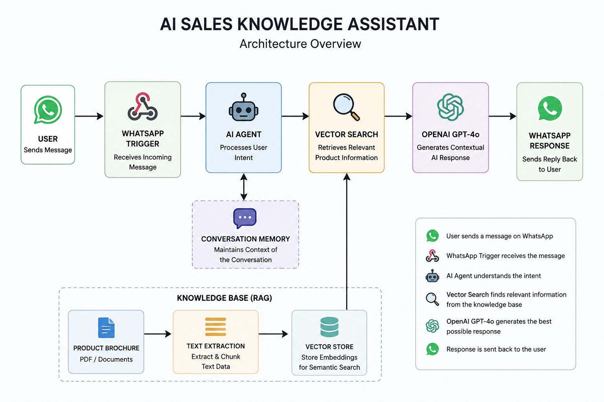
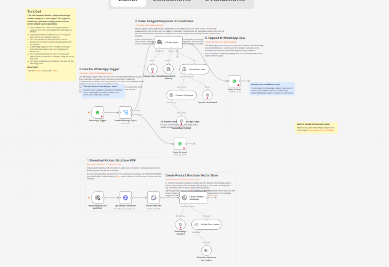

# AI Sales Knowledge Assistant

Production-ready AI sales assistant built with n8n, OpenAI GPT-4o, WhatsApp Cloud API, and Retrieval-Augmented Generation (RAG).

This AI automation workflow enables businesses to automate customer product inquiries using contextual AI responses powered by semantic vector retrieval and conversational memory.

---

# Features

- WhatsApp AI customer interaction
- Retrieval-Augmented Generation (RAG)
- AI-powered semantic product search
- Conversational memory handling
- OpenAI GPT-4o integration
- PDF knowledge ingestion pipeline
- Vector similarity search
- Multi-turn contextual conversations
- AI tool-based retrieval workflow
- Automated customer support responses
- Workflow automation using n8n
- Knowledge base AI assistant

---

# Technologies

- n8n
- OpenAI GPT-4o
- OpenAI Embeddings
- WhatsApp Cloud API
- LangChain Nodes
- Vector Store Architecture
- PDF Extraction Pipeline
- Semantic Search
- AI Automation Workflows

---

# Architecture



---

# Workflow Overview

1. Customer sends a WhatsApp message
2. WhatsApp Trigger receives the request
3. AI Agent processes user intent
4. Vector search retrieves relevant catalog information
5. GPT-4o generates contextual AI response
6. AI response is returned to the customer through WhatsApp

---

# Use Cases

- AI customer support automation
- AI sales assistant systems
- Product recommendation workflows
- WhatsApp AI chatbot automation
- AI knowledge base assistants
- Automated product inquiry systems
- Enterprise AI workflow automation

---

# Running This Project

1. Clone the repository

```bash
git clone https://github.com/NuelLogics/ai-sales-knowledge-assistant.git
```

2. Import the workflow JSON into n8n

3. Configure credentials:
   - OpenAI API
   - WhatsApp Cloud API

4. Upload your product brochure or knowledge source

5. Activate the workflow

6. Test using WhatsApp messages

---

# Preview

## Workflow Overview



---

# Possible Improvements

- Replace in-memory vector store with Qdrant
- Add PostgreSQL persistent memory
- Add Redis rate limiting
- Add observability and logging
- Add multilingual support
- Add voice message processing
- Add human escalation handling

---

# What I Learned

This project strengthened my understanding of:
- Retrieval-Augmented Generation (RAG)
- AI workflow orchestration
- semantic vector retrieval
- conversational memory systems
- AI-powered automation architecture
- WhatsApp API integrations
- scalable AI assistant design

---

# Overall Growth

This project improved my ability to design AI systems that combine:
- automation
- contextual AI
- vector databases
- conversational interfaces
- workflow engineering

It also deepened my understanding of production-ready AI automation architecture using n8n and LLM-powered systems.

---

# Author

Martin Emmanuel  
Nuel Logics

---

# Connect With Me

[](https://www.upwork.com/freelancers/~01736246aba051cc59)

[](https://github.com/NuelLogics)
